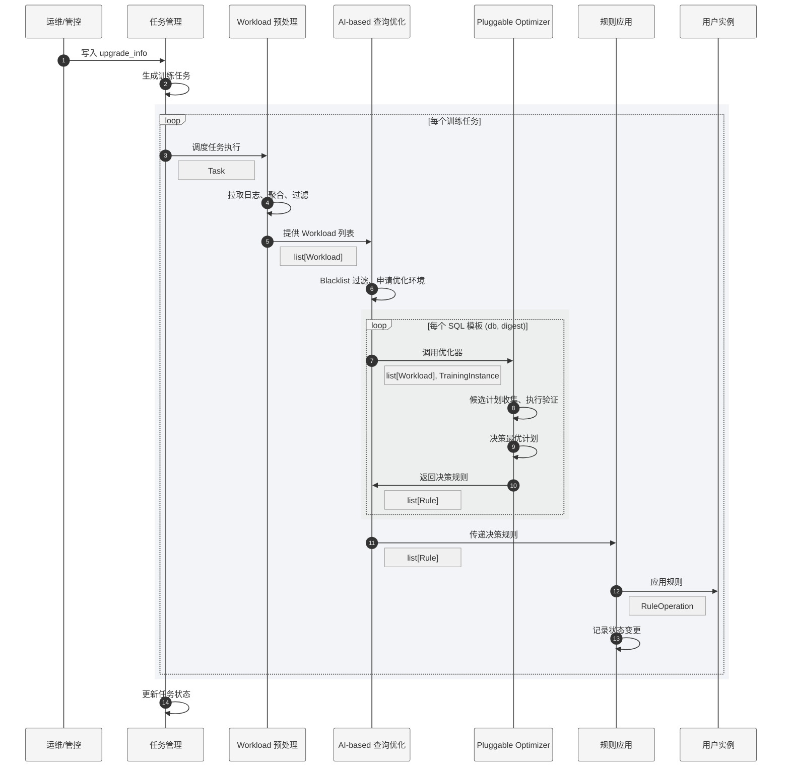

## Overview
### AI 优化器系统流程图



### AI 优化器系统架构图

---

## AI 优化器模块功能
### 任务管理

任务管理模块划分为三个子功能：

#### 任务规划

通过定时任务、负载变更监控、人工等方式，生成需要执行的训练任务，写入任务表。

**任务定义**：`(task_id, instance_id, upgrade_id, workload_set)`
- `workload_set`：包含 `(db, digest)` 的列表，留空表示**全量训练**，非空表示**增量训练**

**任务类型**：

| 任务类型 | 生成方式 | 说明 |
|------|------|
| 全量优化任务 | 定时扫描历史任务 | 定期扫描 `upgrade_info` 和 `tasks` 表，寻找训练间隔大于阈值（如 7 天/30 天）的实例，生成全量训练任务 |
| 增量优化任务 | 实例负载变更监控 | 定期扫描 SPM 中新捕获的计划，对存在新 `(db, digest)` 的实例生成增量训练任务 |

**增量训练触发逻辑**：

基于 SPM 计划捕获触发增量训练任务：

```sql
SELECT DISTINCT DB, DIGEST 
FROM information_schema.txsql_spm_plan_detail 
WHERE ORIGIN = 'AUTO-CAPTURE' AND CREATED_AT > {last_training_date};
```

时间戳选择规则：

- `workload_set` 在创建任务时确定，下次增量任务应使用**任务创建时间**（而非完成时间）查询 SPM
- 若期间完成了全量训练任务，后续增量任务从**全量任务开始时间**统计

```
t0 --- t1（提交增量任务 task_1） --- t2（全量任务开始）--- t3（全量任务完成）--- t4（task_1 完成）--- t5（提交增量任务 task_2）
```

上例中，`task_2` 确定 `workload_set` 时，应从 `max(t1, t2)` 开始筛选。

#### 任务调度

读取任务表，寻找满足运行条件的训练任务，在控制并发度的情况下进行调度。

**运行条件检查**：
- **运维窗口**：对于不支持克隆的实例，仅限运维窗口内调度
- **实例状态**：拉取最新 `upgrade_info`，检查实例在线/下线状态
- **版本检查**：读取 upgrade_info 中的内核版本号，检查 AI 优化器兼容性

#### 任务执行

针对给定的单个训练任务，执行优化流程：Workload 预处理 → AI 查询优化 → 规则管理。

---

### Workload 预处理

#### 处理流程

1. **日志读取**
   - 数据源：
     - **AWR**：依赖新版本内核，可获取 `(instance, db, digest, plan_id)` 级聚合数据
     - **Slow Log**：依赖 `long_query_time` 参数配置
     - **Audit Log**：5.7/8.0 全部支持，历史负载丰富
   - 拉取范围：过去 30 天
   - 增量训练适配：支持按 `workload_set` 过滤指定的 `(db, digest)`

2. **数据聚合**
   - 聚合维度：`(instance_id, db, digest, plan_id)`
     - 其中 `plan_id` 仅 AWR 数据源提供
   - 其它标识：`md5`（仅 Slow Log 数据源提供，用于去重）
   - 聚合指标：执行次数、训练样本（random/min/max SQL）、执行时延（min/max/avg）

3. **风险负载过滤**
   - 非 SELECT 语句
   - 包含 index hints / index-level optimizer hints
   - 包含 TxsqlAImarker（忽略大小写）
   - 包含存储过程调用
   - 包含 routines（**⚠️ 需连接 online_server 查询** `INFORMATION_SCHEMA.ROUTINES`）
   - SQL 文本长度大于 10176

4. **输出存储**
   - 存储至 `ai_metadata.workload` 表

---

### AI 查询优化

AI 查询优化模块是可插拔的优化器框架，当前支持**小模型优化器**和 **LLM 优化器**。

#### 处理流程

1. **读取预处理的 Workload**
   - 按 `(instance_id, db, digest)` 分组
   - **⚠️ 防御性检查：风险 SQL 过滤**

2. **Blacklist 过滤**
   - `blacklist` 表由管控维护
   - `enabled = TRUE` 的记录将被跳过训练

3. **~~优化环境申请~~** -> **优化环境动态切换**
   - 只读任务
     - 对于 NCDB，执行前管控分配好内部 RO，训练过程无需切换
     - 对于 CDB，执行前管控下发 slave 信息，训练在指定时间内完成则无需切换，若超时则动态申请克隆实际继续训练
   - 读写任务
     - 执行前管控分配好克隆实例，训练过程无需切换

4. **调用 Pluggable Optimizer**
   - 输入：SQL 模板标识、SQL 样本列表、优化环境
   - 输出：决策规则（`optimize` 或 `default`）

5. **存储决策规则**
   - 关联 `task_id`，写入 `rules` 表

#### 决策规则类型

| action | 语义 | 后续操作 |
|--------|------|----------|
| `optimize` | 找到更优计划 | 固定或 accept 该计划 |
| `default` | 默认计划最优 | 删除/重置干预规则 |

#### 规则生成规范

对于同一个 SQL 模板 `(db, digest)`，优化器返回的 `list[DecidedRule]` **必须**满足以下二选一：

- **单条 DEFAULT**：恰好 1 条 `action=default` 的规则（表示无法找到更优计划，需重置干预规则）
- **一条或多条 OPTIMIZE**：`action=optimize` 的规则（表示找到更优计划）
  - Statement Outline 模式：恰好 1 条（只能绑定单一规则）
  - SPM 模式：可以多条（每条对应一个 qualified plan，全部 accept）

此约束是决策逻辑的必然结果：优化器在生成规则前必须完成**跨样本验证**——只有当候选计划在所有样本上均属于 Valid 集合（即优于默认计划，或与默认计划相同）且至少在一个样本上优于默认计划时，才允许生成 `optimize` 规则（参见"形式化定义"中的 Relaxed Intersection Policy）。这一验证机制保证了结果只会是"全部通过 → optimize"或"无计划通过 → default"，不会出现 `default` 与 `optimize` 混杂的情况。

> **下游假设**：规则应用层通过 `all(r.action == DEFAULT for r in rules)` 判断是否执行重置。若违反此规范产生混杂规则，DEFAULT 规则会被静默忽略，导致：
> 1. 语义不准确 — 优化方案缺乏跨样本泛化性却仍被应用
> 2. 统计计数偏差 — 同一模板同时计入 optimized_count 和 reset_count
> 3. 数据冗余 — DEFAULT 规则被写入 rules 表但在 apply 阶段无效

---

### 规则管理

#### 处理流程

1. **读取决策规则**：通过 `task_id` 关联本次训练产生的规则

2. **查询当前规则状态**：查询 `rule_state_history` 表获取当前状态

3. **决策操作类型**：避免重复操作，保证幂等性

4. **应用规则到用户实例**
   - **Statement Outline 模式**：
     - `optimize`：删除旧规则，添加新规则
     - `default`：删除相关 Outline 规则
   - **SPM 模式**：
     - `optimize`：accept 更优计划，reject 其余计划
     - `default`：reject 除默认计划外的所有计划

5. **记录状态变更**：写入 `rule_state_history` 表

#### 规则操作类型

| 操作 | 语义 | 触发条件 |
|------|------|----------|
| `setup_plan` | 首次绑定优化计划 | 当前无规则，本次决策为 `optimize` |
| `modify_plan` | 修改已绑定的计划 | 当前有规则，plan_ids 不同 |
| `modify_timeout` | 仅修改超时时间 | plan_ids 相同，timeout 不同 |
| `reset` | 重置为默认计划 | 当前有规则，本次决策为 `default` |
| `noop` | 无需操作 | 规则完全相同（幂等） |

---

## 数据库访问安全约束

训练流程涉及三类 MySQL 连接：**训练节点**（slave/RO/clone）、**在线节点**（master/rw）、**元数据库**（meta server）。各连接的访问权限有严格限制，核心原则是：

> **在线节点（master/rw）的访问仅允许发生在规则写入阶段（APPLYING）。训练流程的其他所有阶段，禁止访问在线节点。**

### 各连接职责划分

| 连接 | 允许的操作 | 禁止的操作 |
|------|-----------|-----------|
| **训练节点** | feature 检测、EXPLAIN、执行时间验证、routine 列表查询、digest 计算 | 规则写入、全局变量修改 |
| **元数据库** | workload 存储、规则存储、状态记录 | — |
| **在线节点** | SPM/Outline 规则写入（APPLYING 阶段） | 任何预处理或优化查询 |

### 各阶段访问约束

| 执行阶段 | 允许访问的连接 | 说明 |
|---------|--------------|------|
| INITIALIZING | 训练节点 | feature detection 探测训练实例能力；训练环境预期与在线实例保持一致 |
| LOADING_WORKLOAD | 训练节点、元数据库、ClickHouse | routine 列表查询和 digest 计算使用训练节点；AWR/SlowLog 原始数据来自 ClickHouse |
| OPTIMIZING | 训练节点、元数据库 | 所有 EXPLAIN 和执行时间验证在训练节点；digest_text 计算使用训练节点；规则/日志写入元数据库 |
| APPLYING | 在线节点、元数据库 | 规则写入在线节点；状态变更记录写元数据库 |

### 设计原因

在线节点是用户生产环境，任何非必要的查询（EXPLAIN、digest 计算、feature 探测）发送到在线节点都存在以下风险：
- 对高负载实例产生额外压力
- 若连接配置错误，可能将未审核的操作发送到错误节点

因此，所有预处理和优化操作统一使用训练节点。训练环境（slave/RO/clone）预期与在线实例具备相同的数据库能力，feature 检测结果在训练节点上同样有效。

**Digest 计算使用训练节点**：`STATEMENT_DIGEST()` 和 `STATEMENT_DIGEST_TEXT()` 均为 MySQL 内置纯函数，零 IO 开销，不访问任何表数据。计算结果受 `max_digest_length` 及内核版本影响；训练节点作为在线实例的 slave/RO/clone，版本和配置天然一致，因此在训练节点上计算比在元数据库（版本可能不同）上计算更为可靠。Slow Log 数据源不提供 digest 字段，由 preprocessor 在 LOADING_WORKLOAD 阶段调用 `STATEMENT_DIGEST()` 补算（AWR 自带 digest，无需计算）；`STATEMENT_DIGEST_TEXT()` 在 OPTIMIZING 阶段由 `optimize_template` 计算。两者统一在训练节点上执行。

---

## 优化器框架

优化器框架提供统一的优化流程（候选收集、执行验证、决策、可靠性过滤），各优化器在此基础上扩展各自的候选计划生成策略。

### 优化器类型

| 优化器 | 候选计划生成策略 |
|------|------|
| 小模型优化器 | 基于 possible keys 的索引组合枚举 |
| LLM 优化器 | 基于 MCTS 搜索生成候选 |

### 优化流程

1. **输入 SQL 样本集合**
   - 从 workloads 中收集所有 SQL 样本并去重

2. **收集候选计划**
   - **默认计划集合 D**：**【开启 PlanID 和 hints 捕获功能】**对所有 SQL 样本执行 EXPLAIN 获取
   - **优化器扩展计划集合 P**：由各优化器各自的候选生成策略提供
   - **SPM 捕获计划集合 S**：从 SPM 中读取已捕获的计划（仅 SPM 模式）
   - **候选计划集合 C**：取并集 C = D ∪ P ∪ S，按 PlanID 去重

3. **检查候选计划是否满足优化条件**
   - 是否存在优化空间：若 |C| = 1，无需优化，返回 `default` 规则
   - 计划干预是否安全：对于 Statement Outline：若 |D| > 1（不同样本的默认计划不同），直接返回 `default` 规则
   - **注：逻辑上来说，“检查优化条件”在“收集候选计划”之后进行，实际实现时，把 |D| > 1 检查放在计划枚举/MCTS调用之前更加高效。**

4. **验证执行时间**
   - 连接 training server，验证 session 需关闭 spm/outline 功能
   - 对每个 SQL 样本 s 和候选计划 c ∈ C，测量执行时间 time(c, s)
   - 超时计划标记为无效

5. **决策优化规则**（见下方形式化定义）

6. **规则可靠性检查**
   - 对 OPTIMIZE 决策，检查验证记录中默认计划的执行时间是否达到最低查询时间阈值
   - 若所有验证记录的默认执行时间均低于阈值，视为不可靠的噪声优化，回退为 DEFAULT

### 形式化定义

**符号定义**：
- **S** = {s₁, s₂, ..., sₙ}：SQL 样本集合
- **D**：默认计划集合（EXPLAIN 获取）
- **P**：优化器扩展计划集合
- **C** = D ∪ P [∪ S]：候选计划集合

**对于每个样本 sᵢ**：
- **default(sᵢ)** ∈ D：样本 sᵢ 的默认计划
- **best(sᵢ)** = argmin_{c∈C} time(c, sᵢ)：样本 sᵢ 上的最优计划
- **better(sᵢ)** = {c ∈ C | time(c, sᵢ) < time(default(sᵢ), sᵢ)}：优于默认计划的计划集合

**决策逻辑 (Relaxed Intersection Policy)**：

要求决策出来的候选计划必须在所有样本上不劣于默认计划（安全性），且至少在一个样本上优于默认计划（收益性）。

1. **基本集合定义**：
   - **Better(s)**：显著优于默认计划的集合。
   - **Valid(s) = Better(s) ∪ {Default(s)}**：安全集合（更优或维持现状）。

2. **决策步骤**：
   - **Step 1 安全交集**：计算所有样本 Valid 集合的交集 $Common = \bigcap Valid(s_i)$。
     - *保证计划在任何样本上都不会退化（Worse）。*
   - **Step 2 收益检查**：从 Common 中筛选出至少在某一个样本上属于 Better 的计划。
     - *保证计划不仅仅是“无害”，而且必须有实际收益。*
   - **Step 3 择优**：若筛选后集合非空，选择平均耗时最低的计划。

> **Statement Outline 附加约束**：若筛选后集合包含多个计划但无法确定全局最优（即没有一个计划在所有样本上都是最快的），Statement Outline 模式返回 `default`（因为 Statement Outline 只能绑定单一规则）。SPM 模式则将所有 qualified plan 全部 accept。

| 场景 | Sample 1 | Sample 2 | 结果 | 说明 |
|------|----------|----------|------|------|
| **纯收益** | Better (A) | Better (A) | **选 A** | 理想优化 |
| **兼容默认** | Better (A) | Default (A) | **选 A** | S1 受益，S2 无损 (遗珠场景) |
| **纯默认** | Default (A) | Default (A) | **不选** | 无实际收益，维持现状 |
| **冲突** | Better (A) | Valid (B) | **不选** | A 在 S2 不安全，放弃 |

> **修订说明**：此前逻辑为Strict Intersection (必须所有样本都Better)，导致“兼容默认”的场景被丢弃。现修订为上述逻辑。 


---
## 接口信息
### 接口表定义

以下接口表由 AI 优化器对外暴露，供管控、运维、前端程序使用。

#### upgrade_info 表

存储可优化的实例信息，**由运维/管控维护**。

| 字段 | 类型 | 说明 |
|------|------|------|
| `upgrade_id` | BIGINT | 主键 |
| `instance_id` | VARCHAR(100) | 实例 ID |
| `upgrade_time` | DATETIME(3) | 升级时间 |
| `offline` | BOOLEAN | 下线状态（true=已下线，跳过调度） |
| `mysql_version` | VARCHAR(30) | MySQL 版本（如 "8.0"） |
| `mysql_subversion` | VARCHAR(30) | 子版本号（如 "20241005"） |
| `outline_type` | VARCHAR(20) | 计划干预类型：`statement_outline`, `spm` |
| `workload_source` | VARCHAR(20) | 负载来源：`awr`, `slowlog`, `auditlog` |
| `region` | VARCHAR(40) | 地域：`bj`, `sh`, `gz`, `sg`, `test` |
| `cluster_id` | INT | 集群 ID |
| `comments` | TEXT | 备注 |

#### tasks 表

存储训练任务，**AI 优化器读写**。

| 字段 | 类型 | 说明 |
|------|------|------|
| `task_id` | BIGINT | 主键 |
| `instance_id` | VARCHAR(100) | 关联实例 ID |
| `upgrade_id` | BIGINT | 关联 upgrade_info |
| `workload_set` | JSON | `[(db, digest)]`，留空=全量训练 |
| `status` | VARCHAR(20) | 任务状态（见下表） |
| `task_create_time` | DATETIME(3) | 任务创建时间 |
| `task_begin_time` | DATETIME(3) | 任务开始时间 |
| `task_end_time` | DATETIME(3) | 任务结束时间 |
| `comments` | TEXT | 备注 |

**任务状态**：

| 状态 | 语义 |
|------|------|
| `created` | 已创建，待调度 |
| `pending` | 待调度/就绪（预留，暂未使用） |
| `deferred` | 已推迟（运行条件暂不满足，比如不在时间窗口） |
| `discarded` | 已丢弃（无法运行，比如实例信息有更新，任务失效） |
| `running` | 运行中 |
| `success` | 执行成功 |
| `failed` | 执行失败 |

#### rules 表

存储 AI 优化器决策的优化规则，**AI 优化器写入，前端/管控查询**。

| 字段 | 类型 | 说明 |
|------|------|------|
| `task_id` | BIGINT | 关联任务 ID |
| `instance_id` | VARCHAR(100) | 实例 ID |
| `db` | VARCHAR(255) | 数据库名 |
| `digest` | VARCHAR(64) | SQL 模板 digest |
| `action` | ENUM | `optimize` / `default` |
| `plan_id` | VARCHAR(64) | 最优计划 ID（`default` 时为空） |
| `hints_text` | TEXT | 纯 hints 文本|
| `sql_text` | TEXT | 原始 SQL 样本 |
| `sql_text_rewritten` | TEXT | 干预后 SQL（含 hints） |
| `feedback_timeout` | BIGINT | 反馈超时（ms），超时后自动禁用 |
| `comments` | TEXT | 备注 |

#### blacklist 表

存储禁用 AI 优化的 SQL 模板列表，**由管控维护**。

| 字段 | 类型 | 说明 |
|------|------|------|
| `id` | BIGINT | 主键 |
| `instance_id` | VARCHAR(100) | 实例 ID |
| `db` | VARCHAR(255) | 数据库名 |
| `digest` | VARCHAR(64) | SQL 模板 digest |
| `enabled` | BOOLEAN | `TRUE`=生效（跳过训练） |
| `comments` | TEXT | 备注 |

#### rule_state_history 表

记录规则状态变更历史，**AI 优化器写入，性能监控/前端查询**。

| 字段 | 类型 | 说明 |
|------|------|------|
| `id` | BIGINT | 主键 |
| `instance_id` | VARCHAR(100) | 实例 ID |
| `db` | VARCHAR(255) | 数据库名 |
| `digest` | VARCHAR(64) | SQL 模板 digest |
| `task_id` | BIGINT | 关联任务 ID |
| `operation` | ENUM | 操作类型（见"规则操作类型"） |
| `prev_plan_ids` | JSON | 变更前 plan_id 列表 |
| `curr_plan_ids` | JSON | 变更后 plan_id 列表 |
| `apply_time` | DATETIME(3) | 规则应用时间 |
| `comments` | TEXT | 变更原因 |

---

### 内部表定义

以下表为 AI 优化器内部使用。

#### workload 表

存储预处理后的工作负载数据。

| 字段 | 类型 | 说明 |
|------|------|------|
| `task_id` | BIGINT | 关联任务 ID |
| `instance_id` | VARCHAR(36) | 实例 ID |
| `db` | VARCHAR(255) | 数据库名 |
| `digest` | VARCHAR(64) | SQL 模板 digest |
| `plan_id` | VARCHAR(64) | Plan ID（仅 AWR 有值） |
| `sql_text` | TEXT | SQL 样本 |
| `count_star` | BIGINT | 执行次数 |
| `elapsed_time_avg/min/max` | DOUBLE | 执行时间统计 |
| `sql_text_min/max` | TEXT | 最快/最慢 SQL |

#### validation_logs 表

存储规则评估的详细日志，用于分析和调试。

| 字段 | 类型 | 说明 |
|------|------|------|
| `id` | BIGINT | 主键 |
| `task_id` | BIGINT | 关联任务 ID |
| `instance_id, db, digest` | - | SQL 模板标识 |
| `hints_text` | TEXT | 候选计划的 hints |
| `sql_text` | TEXT | 原始 SQL |
| `sql_text_rewritten` | TEXT | 带 hints 的 SQL |
| `default_plan_id` | VARCHAR(64) | 默认计划 ID |
| `default_elapsed_time` | DOUBLE | 默认计划执行时间 |
| `default_explain_traditional` | LONGTEXT | 默认计划 EXPLAIN TRADITIONAL 结果 (JSON) |
| `default_analyze_json` | LONGTEXT | 默认计划 EXPLAIN ANALYZE FORMAT=JSON 结果 |
| `default_rows_examined` | BIGINT | 默认计划扫描行数 |
| `plan_id` | VARCHAR(64) | 候选计划 ID |
| `elapsed_time` | DOUBLE | 候选计划执行时间 |
| `explain_traditional` | LONGTEXT | 候选计划 EXPLAIN TRADITIONAL 结果 (JSON) |
| `analyze_json` | LONGTEXT | 候选计划 EXPLAIN ANALYZE FORMAT=JSON 结果 |
| `rows_examined` | BIGINT | 候选计划扫描行数 |
| `is_best` | BOOLEAN | 是否最优计划 |
| `is_better` | BOOLEAN | 是否优于默认计划 |
| `speedup_ratio` | DOUBLE (VIRTUAL) | 加速比 = default_elapsed_time / elapsed_time（生成列） |

---

### 接口依赖

| 类别 | 接口 |
|------|------|
| 工作负载获取 | AWR, Slow Log, Audit Log 读取接口 |
| 配置信息获取 | 运维窗口查询，用户实例信息 |
| 优化环境准备 | Slave 实例查询，内部 RO 申请，克隆实例创建 |

---

## 性能监控

### 基本原理

针对每个 SQL 模板 `(instance_id, db, digest)` 分别执行性能对比：

1. 获取规则变更时间点：从 `rule_state_history` 获取真实的规则变更时间
   - setup_plan, modify_plan, reset 才视为变更
   - 另一个问题，reset 是没有关联的计划的，而且 reset 不应该视为优化，那么是否可以这样处理：如果最新一次操作是 reset，那么就不应该返回给前端？ 至于性能监控，完全可以正常把 reset 视为一个计划变更点来执行性能对比。
3. 读取 AWR 数据，按时间段统计性能
4. 对比各时间段的性能指标

### 注意事项

- 多 PlanID 场景：按 `(instance, db, digest)` 加权计算整体指标

---

## 元数据查询
### 规则变更查询
在旧版本中，SQL 模板、优化规则、验证记录一一对应，可以唯一确定一个 SQL 模板的优化规则、优化前后的 PlanID、（SQL 样本）优化前后的执行时间。

**⚠️ 新版本中，一个 SQL 模板可能对应多条优化规则，每个优化规则可能对应多条验证记录。**

{width=700px}

## 规划排期

| 模块 | 功能 | 开发时间 | 具体事项 |
|------|------|----------|----------|
| 任务管理 | 任务调度与执行框架 | 4d | 任务表 CRUD、状态机、调度主循环、运行条件检查、全量/增量任务规划、异常处理 |
| Workload 预处理 | 数据读取与处理 | 2d | 调用外部 AWR 接口、数据聚合(instance,db,digest,plan_id)、时延统计、训练样本抽取、风险负载过滤 |
| AI 优化框架 | 框架与公共逻辑 | 2d | Pluggable Optimizer 抽象接口、Blacklist 过滤、优化环境接口封装 |
| **小模型优化器** | 候选计划收集 | 3d | EXPLAIN 获取默认计划、多默认计划检测、possible keys 解析、hints 枚举生成、候选去重 |
| **小模型优化器** | 执行验证与决策 | 4d | training server 连接、执行时间测量、超时处理、规则决策逻辑 |
| 规则管理 | 规则应用与状态管理 | 2d | 规则变更状态管理、操作类型决策、Statement Outline/SPM应用、状态变更记录 |
| 性能监控 | 性能监控 | 5d | 规则变更历史获取、性能对比、数据存储
| **合计** | | **22d** | |